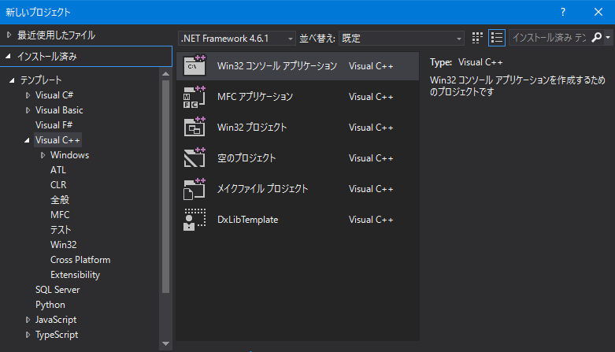

# おまけ1 DxLibの環境構築
基本的に公式サイトの[DXライブラリの使い方](http://dxlib.o.oo7.jp/dxuse.html)を参照  
DxLibを使用するには，Visual Studio, Berlin, Borland C++, MinGW などを用いて使用できますが，  
ここでは最も環境構築が簡単で，デバッグ機能も豊富なVisual Studio を例に紹介します

## 手順
1. Visual Studio のインストール
1. DxLibのダウンロード
1. プロジェクト作成
1. プロジェクトのプロパティ設定
1. プロジェクトテンプレートの作成

### [1. Visual Studio のインストール](http://dxlib.o.oo7.jp/use/dxuse_vs2015express.html#R1)
ほぼ全てのVerのVisual Studio で使用することができます  
初めてVisual Studio をインストールする場合は，Microsoft Dev Essential 
に登録しなければ30日程度しか使用できません  
Visual Studio のダウンロードは[ここ](https://www.visualstudio.com/ja/vs/older-downloads/)などから行えます  
  
既にいずれかのVerのVisual Studio を所持している場合はそれを使用しても大丈夫です  
ただし，"Visual C++"がインストールされている必要があります  
\[プロジェクトの作成\]→\[Visual C++\] と選択したときに，下の画像のような項目が表示されている必要があります  
\(このうちDxLibの開発で使用するのは\[Win32 プロジェクト\]のみ\)  
  

Visua Studio がインストールされているにも関わらず， Visual C++ が使用できない場合は，  
Visual Studio のインストーラから追加でインストールすることができます  

### 2. DxLibのダウンロード
[公式HPのこちらのページ](http://dxlib.o.oo7.jp/dxdload.html) から\[DXライブラリ Windows版 
VisualStudio\(C++用\) \(VerX.xx\)をダウンロードする\(自己解凍形式\(約XX.xMB\)\)\]と書かれたリンクを
クリックすることで，DxLibのダウンロードが始まります  
ダウンロードされた.exeファイルを実行すると，解答が始まり，同じディレクトリ内に\[DxLib\_VC\]
と書かれたフォルダが作成されます  
このフォルダの中にある\[プロジェクトに追加すべきファイル\_VC用\]というフォルダがDxLibの本体です  
\[Tool\]フォルダに入っているアプリケーションは，DxLib用のシェーダのコンパイラや，リソースファイルの
アーカイブ用ソフト，3DモデルをDxLibに最適な形に変換するコンバータなど，DxLibの特定の機能を使用する際に
必要となるアプリケーションです．  
  
DxLibの環境構築に必要なのは\[プロジェクトに追加すべきファイル\_VC用\]フォルダだけなので，
このフォルダをどこか適当な場所に保存しておきましょう．

