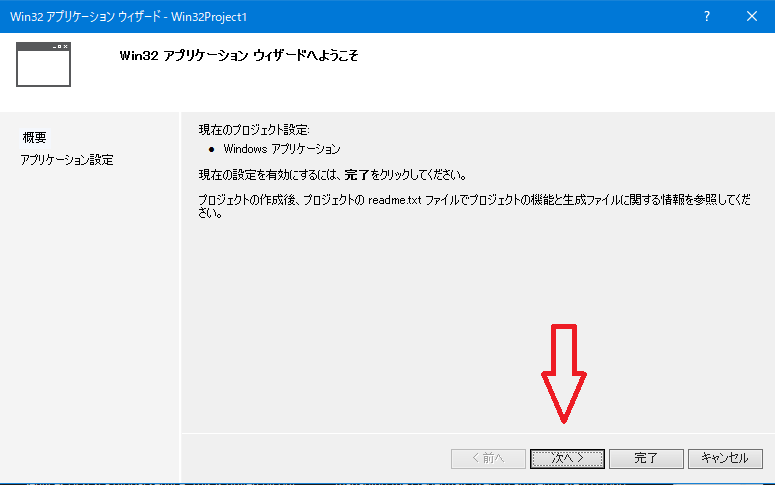
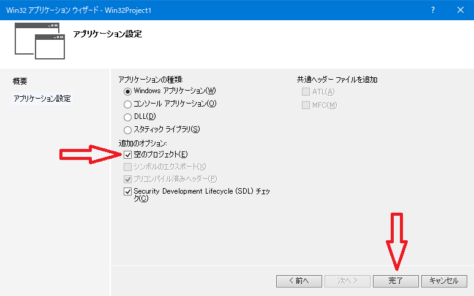
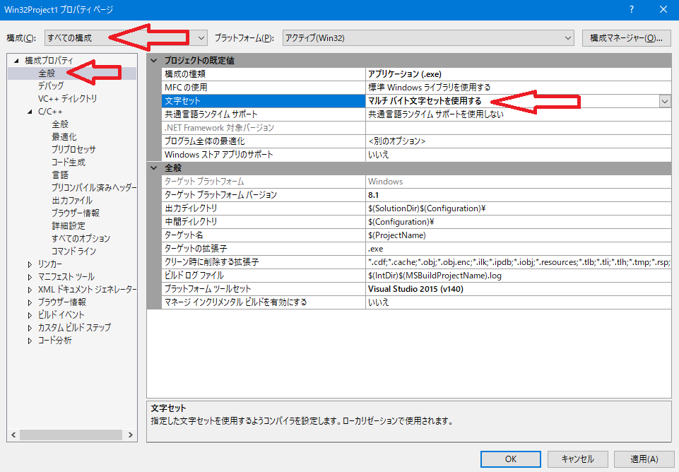
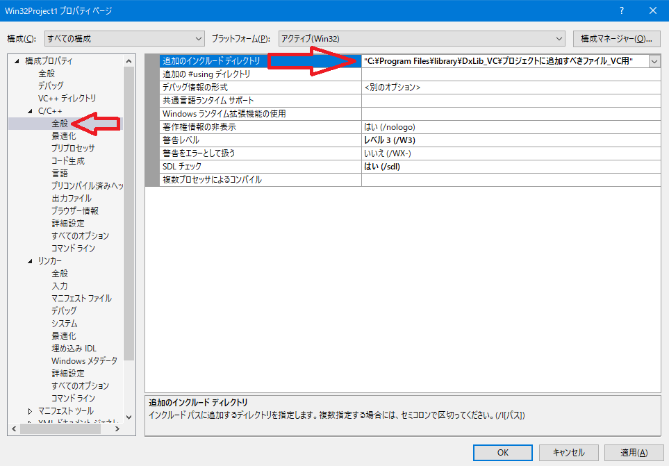
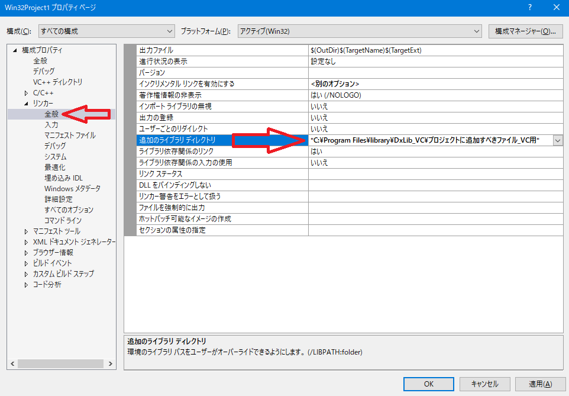
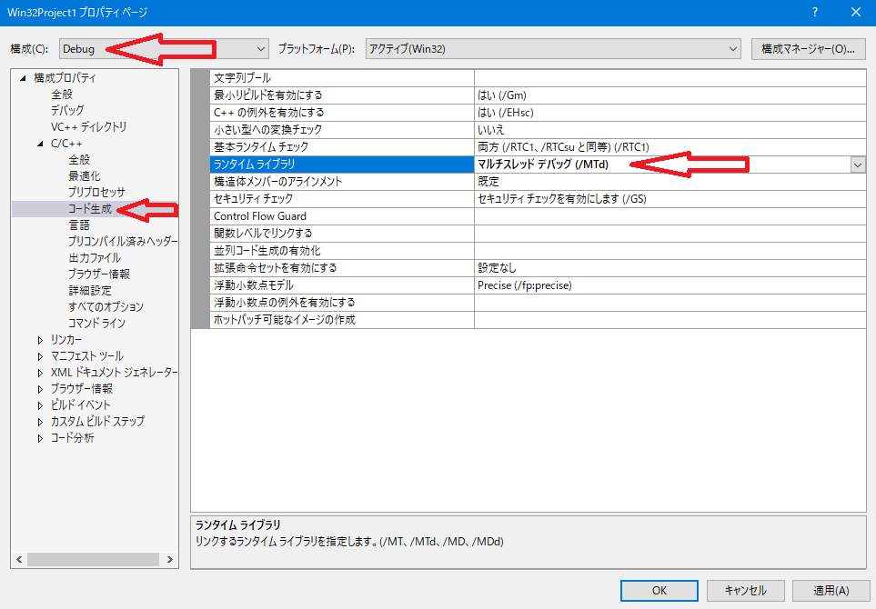

# おまけ1 DxLibの環境構築
基本的に公式サイトの[DXライブラリの使い方](http://dxlib.o.oo7.jp/dxuse.html)を参照  
というか公式サイトの方法に少し付け加えた程度しか書いてません．
DxLibを使用するには，Visual Studio, Berlin, Borland C++, MinGW などを用いて使用できますが，  
ここでは恐らく最も環境構築が簡単で，デバッグ機能も豊富なVisual Studio を例に紹介します

## 手順
1. Visual Studio のインストール
1. DxLibのダウンロード
1. プロジェクト作成
1. プロジェクトのプロパティ設定
1. \(動かしてみる\)
1. プロジェクトテンプレートの作成

### [1. Visual Studio のインストール](http://dxlib.o.oo7.jp/use/dxuse_vs2015express.html#R1)
ほぼ全てのVerのVisual Studio で使用することができます  
初めてVisual Studio をインストールする場合は，Microsoft Dev Essential 
に登録しなければ30日程度しか使用できません  
Visual Studio のダウンロードは[ここ](https://www.visualstudio.com/ja/vs/older-downloads/)などから行えます  
  
既にいずれかのVerのVisual Studio を所持している場合はそれを使用しても大丈夫です  
ただし，"Visual C++"がインストールされている必要があります  
\[プロジェクトの作成\]→\[Visual C++\] と選択したときに，下の画像のような項目が表示されている必要があります  
\(このうちDxLibの開発で使用するのは\[Win32 プロジェクト\]のみ\)  
  

Visua Studio がインストールされているにも関わらず， Visual C++ が使用できない場合は，  
Visual Studio のインストーラから追加でインストールすることができます  

### 2. DxLibのダウンロード
[公式HPのこちらのページ](http://dxlib.o.oo7.jp/dxdload.html) から\[DXライブラリ Windows版 
VisualStudio\(C++用\) \(VerX.xx\)をダウンロードする\(自己解凍形式\(約XX.xMB\)\)\]と書かれたリンクを
クリックすることで，DxLibのダウンロードが始まります  
ダウンロードされた.exeファイルを実行すると，解凍が始まり，同じディレクトリ内に\[DxLib\_VC\]
と書かれたフォルダが作成されます  
このフォルダの中にある\[プロジェクトに追加すべきファイル\_VC用\]というフォルダがDxLibの本体です  
\[Tool\]フォルダに入っているアプリケーションは，DxLib用のシェーダのコンパイラや，リソースファイルの
アーカイブ用ソフト，3DモデルをDxLibに最適な形に変換するコンバータなど，DxLibの特定の機能を使用する際に
必要となるアプリケーションです．  
  
DxLibの環境構築に必要なのは\[プロジェクトに追加すべきファイル\_VC用\]フォルダだけなので，
このフォルダをどこか適当な場所に保存しておきましょう．

### 3. [プロジェクトの作成](http://dxlib.o.oo7.jp/use/dxuse_vs2015express.html#R2)
1. Visual Studio を起動して\[ファイル\]→\[新規作成\]→\[プロジェクト\]の順に選択します
1. 左側のメニューから\[インストール済み\]→\[テンプレート\]→\[Visual C++\]を選択します
1. 先ほど示した画像の画面になるので，\[Win32 プロジェクト\]を選択し，プロジェクトの名前，場所を設定して
\[OK\]を選択します
1. \[Win32 アプリケーションウィザード\]が開かれるので，\[次へ\]を選択します
1. デフォルトの状態から，\[空のプロジェクト\]に追加でチェックをして\[完了\]を選択します
1. プロジェクトの作成は以上です
  
  
  

### 4. [プロジェクトのプロパティ設定](http://dxlib.o.oo7.jp/use/dxuse_vs2015express.html#R4)
プロジェクトのプロパティを設定するためには，ソースファイルが存在する必要があります  
\[プロジェクト\]→\[新しい項目の追加\]を選択\(ショートカット:Ctrl+Shif+A\)します  
左のメニューから\[インストール済み\]→\[Visual C++\]を選択し，真ん中のメニューで\[C++ファイル\]を選択します  
ファイル名を適当に入力し，\[追加\]を選択します．  
これでプロジェクトにソースファイルを追加することができます．  
  
  
  
**ここからが**この環境構築の最も面倒かつ躓きやすい点です  
まず，\[プロジェクト\]→\[\(プロジェクト名\)のプロパティ\]の順に選択して，
作成したプロジェクトのプロパティページを開きます．
  
ここで設定する内容は，左上の\[構成\]で\[Debug\]，\[Release\]，\[すべての構成\]の3つ全てに対して別々の
変更を加える必要があります．  
  
#### 1. すべての構成
まずは，左上の\[構成\]を\[すべての構成\]に変更します．  
* 文字セットの変更
  * 左メニューから\[構成プロパティ\]→\[全般\]の順に選択します
  * 中央メニューの\[文字セット\]の項目を\[**マルチバイト文字セットを使用する**\]に変更します．
    
* インクルードディレクトリの設定
  * 左メニューから\[構成プロパティ\]→\[C/C++\]→\[全般\]を選択します
  * 中央メニュー一番上の\[追加のインクルードディレクトリ\]の項目に，先ほどダウンロードした
	\[プロジェクトに追加すべきファイル\_VC用\]フォルダのパスを入力します
    
* 追加のライブラリ設定
  * 左メニューから\[構成プロパティ\]→\[リンカー\]→\[全般\]を選択します
  * 中央メニューから，\[追加のライブラリディレクトリ\]を選択し，インクルードディレクトリの設定で
	記入したパスと同じものを再度入力します  
  

設定が完了したら右下の\[適用\]を押して保存しましょう  
  
#### 2. Debug
\[すべての構成\]ではDebug,Releaseに共通する設定を行いましたが，ここからは別個に設定をする必要があります．
\(デバッグ機能を使わない場合は，この項目は飛ばしても大丈夫です\)  
  
* ランタイムライブラリの設定
  * 左メニューから\[構成プロパティ\]→\[C/C++\]→\[コード生成\]を選択します
  * \[ランタイムライブラリ\]の項目を，\[**マルチスレッドデバッグ\(/MTd\)**\]に変更します
  * この時，似ている項目が複数あるので，必ず括弧内まであっていることを確認してください

#### 3. Release
最後にReleaseでの設定です  
こちらはDebugとの差分なので変更箇所はDebugの時と同じです．
* ランタイムライブラリの設定
  * 左メニューから\[構成プロパティ\]→\[C/C++\]→\[コード生成\]を選択します
  * \[ランタイムライブラリ\]の項目を，\[**マルチスレッド\(/MT\)**\]に変更します

以上でプロパティの設定は全て終了です．右下の\[OK\]を押して保存，終了しましょう
